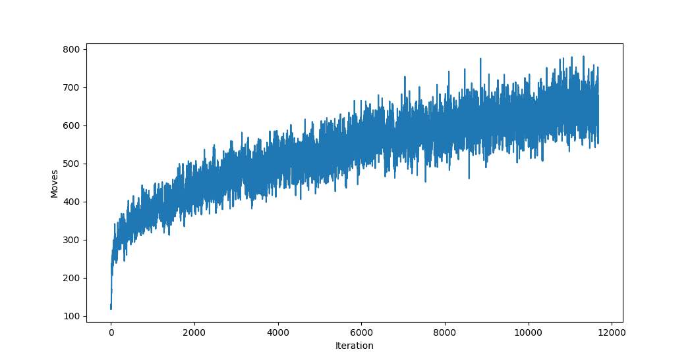

# 2048 AI

A bot that plays the game [2048](https://github.com/gabrielecirulli/2048).

It consists of two small neural networks for the playing
polcy and value function, which are optimized using
[Proximal Policy Optimization (PPO)](https://arxiv.org/abs/1707.06347).

## Results

<figure>
  
  <figcaption>The bot's average number of moves per game per batch of training.</figcaption>
</figure>

After training for a few hours on a CPU, the bot is able
to get good enough to sometimes beat the game by building
the 2048 block.

## Usage

- `main.py` is a script to train the bot and periodically write checkpoints.
- `demo.py` allows you to view games from the bot. You can use it to see that the bot beats the game by building the 2048 block!
- `game.py` is just the game itself.
